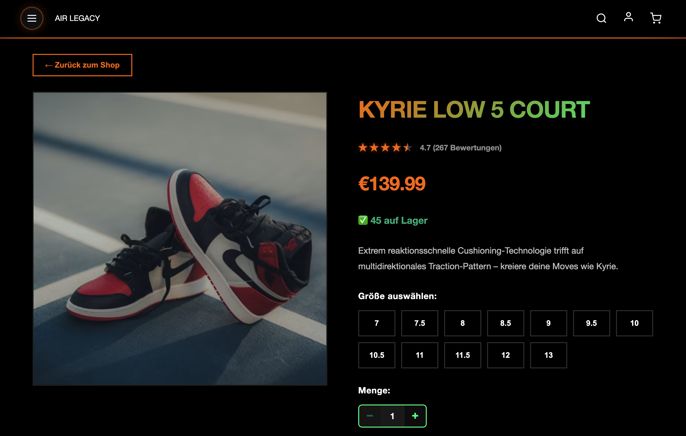
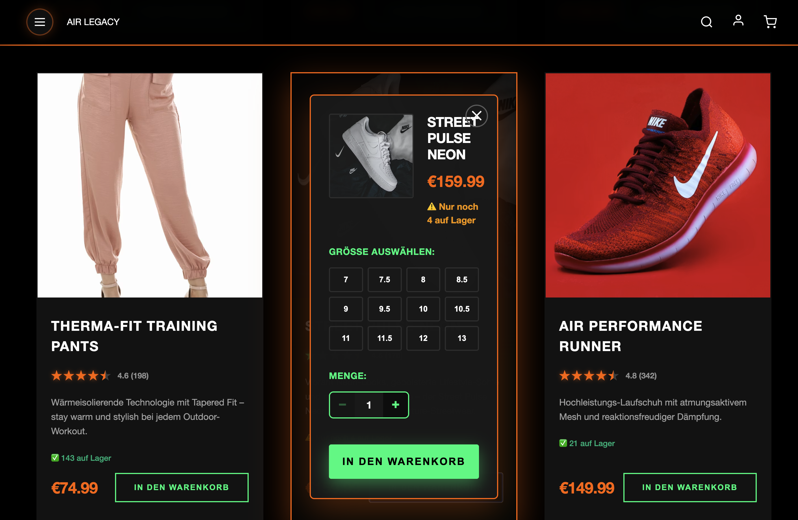
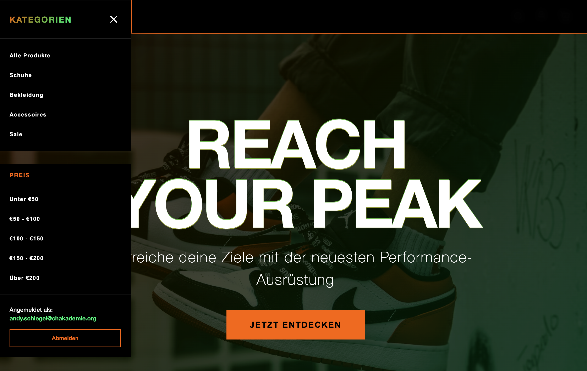
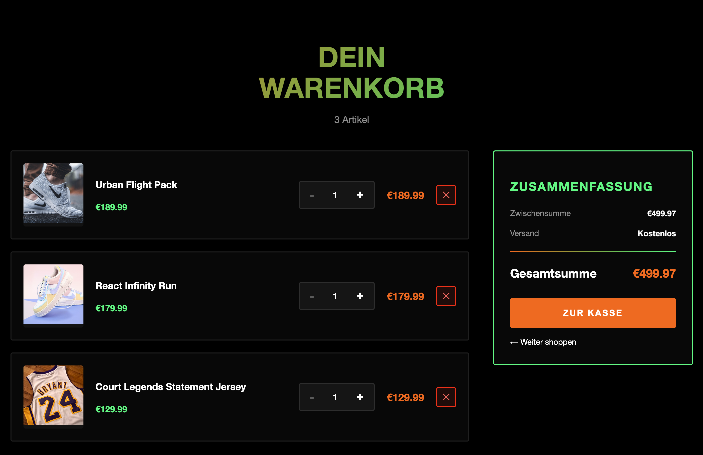
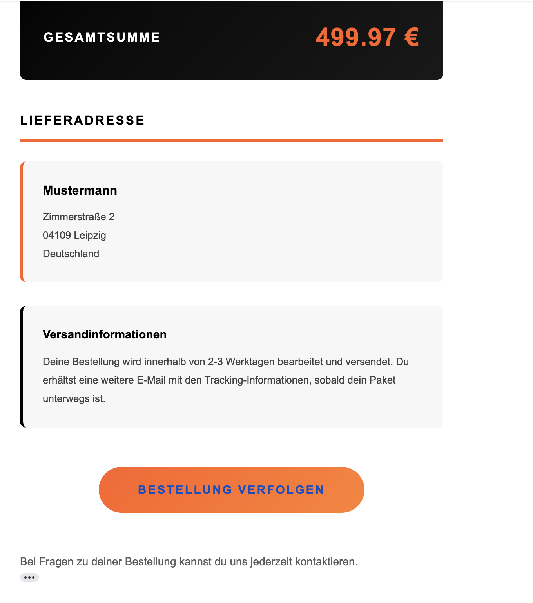
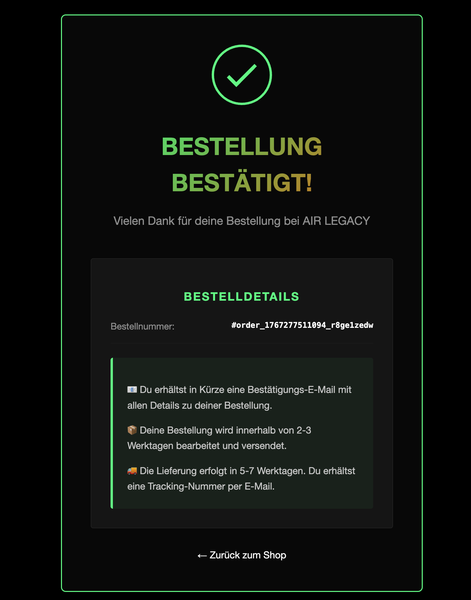
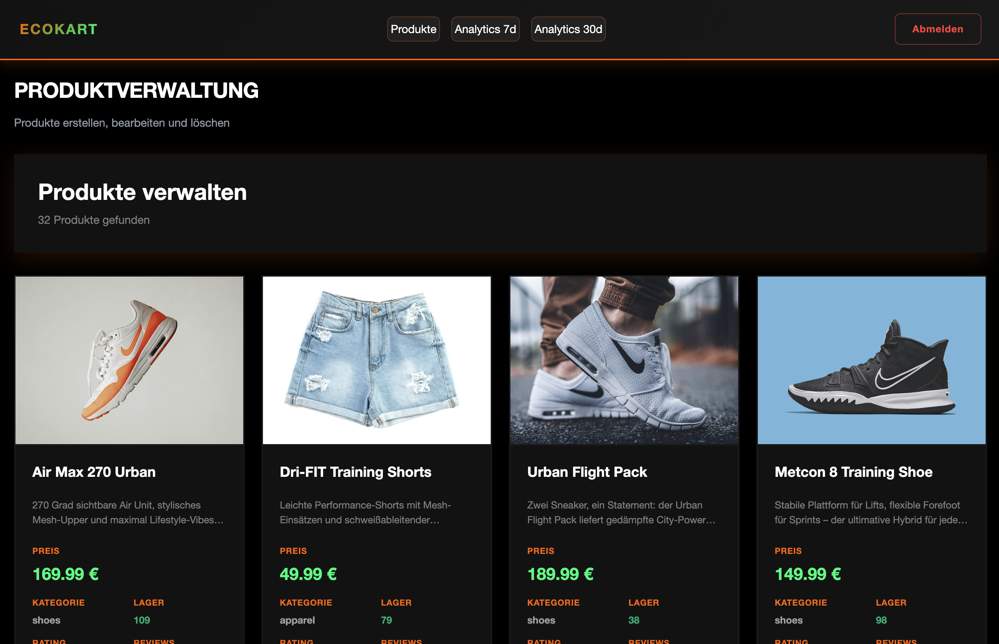
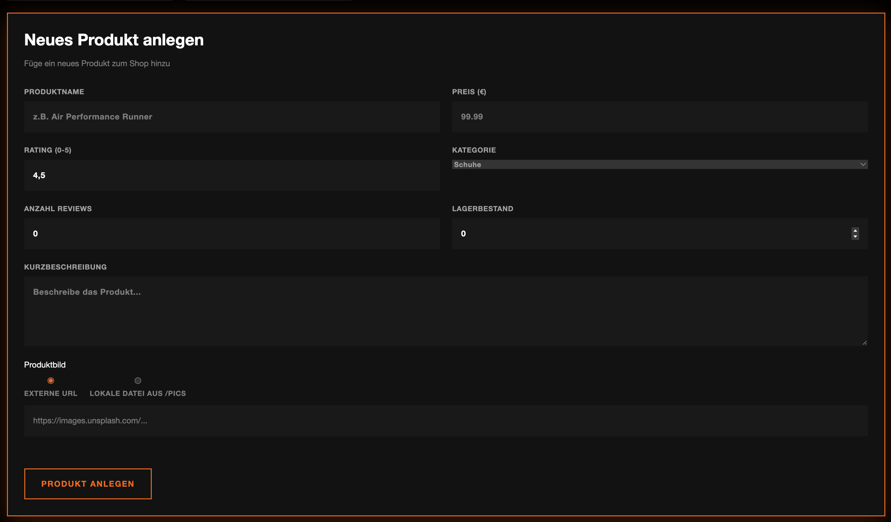
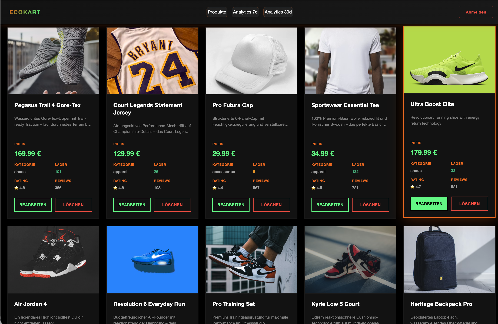
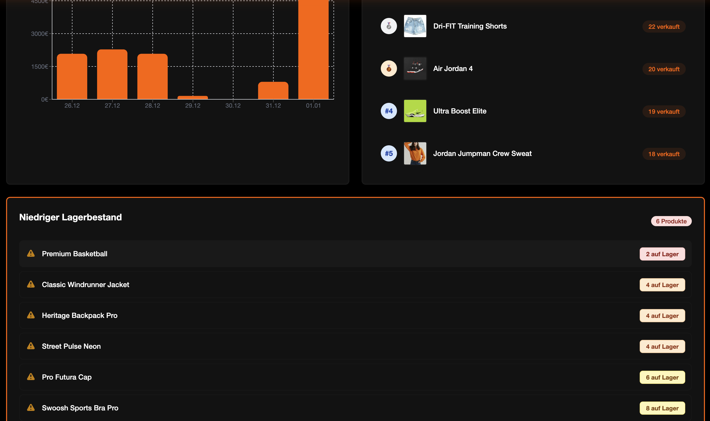

# 🛒 AIR LEGACY - Serverless E-Commerce Platform

> **Production-ready serverless e-commerce platform showcasing modern AWS architecture, Infrastructure as Code, and full-stack development skills.**

[](https://aws.amazon.com/)
[](https://www.terraform.io/)
[](https://nextjs.org/)
[](https://www.typescriptlang.org/)
[](https://jestjs.io/)
[](https://github.com/AndySchlegel/Ecokart-Webshop/security)
[](LICENSE)

**Live Demo:** [🛍️ Customer Shop](https://shop.aws.his4irness23.de) | [⚙️ Admin Dashboard](https://admin.aws.his4irness23.de)


---

## 📋 Table of Contents

- [Overview](#overview)
- [Key Features](#key-features)
- [Architecture](#architecture)
- [Tech Stack](#tech-stack)
- [Live Demo](#live-demo)
- [Security](#security)
- [Getting Started](#getting-started)
- [Deployment](#deployment)
- [Project Health](#project-health)
- [Cost Analysis](#cost-analysis)
- [Documentation](#documentation)
- [Lessons Learned](#lessons-learned)
- [Contributing](#contributing)

---

## 🎯 Overview

AIR LEGACY is a full-stack e-commerce platform built to demonstrate:

- **Serverless Architecture**: 100% AWS Lambda + DynamoDB, no EC2 instances
- **Infrastructure as Code**: Complete Terraform automation (15 modules, 100% reproducible)
- **Modern Frontend**: Next.js 14 with Server-Side Rendering + TypeScript
- **Production-Ready**: Cognito auth, Stripe payments, Resend emails, automated testing
- **Cost-Optimized**: ~$10-15/month for complete e-commerce stack
- **CI/CD Excellence**: GitHub Actions with OIDC, branch-based deployments

### Project Goals

1. ✅ Build production-ready e-commerce platform on AWS
2. ✅ Demonstrate Infrastructure as Code mastery (Terraform)
3. ✅ Showcase full-stack development skills (Next.js + Express.js + TypeScript)
4. ✅ Implement modern DevOps practices (CI/CD, automated testing, monitoring)
5. ✅ Document architectural decisions and learnings (39 documented learnings)

### Why This Project Stands Out

**Portfolio Differentiators:**
- ✅ **100% Reproducible** - Complete infrastructure in Terraform, auto-seeding included
- ✅ **Multi-Environment** - Dev, Staging, Production with branch-based deployments
- ✅ **Real Payments** - Stripe integration with webhooks (not a mock)
- ✅ **Email Integration** - Resend for transactional emails (production-ready)
- ✅ **Automated Testing** - 63 unit tests, 60-69% coverage
- ✅ **CloudWatch Monitoring** - 9 alarms for proactive issue detection
- ✅ **Documented Journey** - 39 learnings from real implementation challenges

---

## 🔑 Key Features

### Customer Experience
- 🛍️ **Product Browsing** with real-time stock levels (green/orange/red indicators)
- 🔢 **Quantity Selector** - Choose quantity before adding to cart (stock-aware)
- 🛒 **Shopping Cart** with persistent storage (DynamoDB-backed)
- 💳 **Secure Checkout** via Stripe (PCI-compliant payment processing)
- 📧 **Order Confirmations** via Resend email service (beautiful HTML templates)
- 👤 **User Authentication** with AWS Cognito (email verification, JWT tokens)
- 🌍 **Global CDN** - CloudFront for product images (fast worldwide delivery)

### Admin Dashboard
- 📊 **Real-time Analytics** (revenue, orders, customers with trends)
- 📦 **Product Management** (CRUD operations, stock management)
- 🖼️ **Image Management** - Upload product images via Terraform
- 👥 **Customer Overview** with registration trends
- 📈 **Sales Reports** with time-series data
- 🔒 **Basic Auth Protection** - Optional HTTP Basic Auth for staging

### Technical Excellence
- ⚡ **Serverless**: Auto-scaling, pay-per-use, zero infrastructure management
- 🔒 **Security**: Cognito JWT validation, HTTPS everywhere, encrypted data at rest
- 🚀 **CI/CD**: GitHub Actions with OIDC (no long-lived credentials)
- 📊 **Monitoring**: CloudWatch Logs + 9 Alarms (Lambda errors, API 5xx, DynamoDB throttling)
- 🌍 **CDN**: CloudFront for global asset delivery
- 🧪 **Testing**: 63 unit tests with Jest, 60-69% coverage
- 📝 **Documentation**: 39 documented learnings, architecture guides

---

## 🏗️ Architecture

### High-Level Architecture

```
┌─────────────────────────────────────────────────────────────┐
│                         USER                                │
└─────────────────────────────────────────────────────────────┘
                            │
        ┌───────────────────┼───────────────────┐
        │                   │                   │
        ▼                   ▼                   ▼
┌───────────────┐   ┌───────────────┐   ┌──────────────┐
│  CUSTOMER     │   │  ADMIN        │   │  MOBILE APP  │
│  FRONTEND     │   │  FRONTEND     │   │  (Future)    │
│  (Next.js)    │   │  (Next.js)    │   │              │
└───────────────┘   └───────────────┘   └──────────────┘
│  Amplify App  │   │  Amplify App  │
│  - Auto Build │   │  - Auto Build │
│  - CDN        │   │  - Basic Auth │
│  - SSL/TLS    │   │  - SSL/TLS    │
└───────────────┘   └───────────────┘
        │                   │
        └───────────────────┼───────────────────┘
                            │
                            ▼
                    ┌───────────────┐
                    │  Route53      │
                    │  DNS          │
                    │  - shop.aws.* │
                    │  - admin.aws.*│
                    │  - api.aws.*  │
                    └───────────────┘
                            │
        ┌───────────────────┼───────────────────┐
        │                   │                   │
        ▼                   ▼                   ▼
┌───────────────┐   ┌───────────────┐   ┌──────────────┐
│  ACM          │   │  CloudFront   │   │  API Gateway │
│  Certificate  │   │  (Assets CDN) │   │  REST API    │
│  - SSL/TLS    │   │  - Images     │   │  - CORS      │
│  - us-east-1  │   │  - Global     │   │  - Cognito   │
└───────────────┘   └───────────────┘   │    Authorizer│
                            │           └──────────────┘
                            │                   │
                            ▼                   ▼
                    ┌───────────────┐   ┌──────────────┐
                    │  S3 Assets    │   │  Lambda      │
                    │  - Private    │   │  (Node.js 20)│
                    │  - Encrypted  │   │  - Express.js│
                    └───────────────┘   │  - 512 MB    │
                                        │  - 30s timeout│
                                        └──────────────┘
                                                │
            ┌───────────────────────────────────┼─────────────────┐
            │                                   │                 │
            ▼                                   ▼                 ▼
    ┌───────────────┐                  ┌───────────────┐  ┌─────────────┐
    │  DynamoDB     │                  │  Cognito      │  │  Resend     │
    │  4 Tables:    │                  │  User Pool    │  │  Email API  │
    │  - Products   │                  │  - Email Auth │  │  - 3k/month │
    │  - Users      │                  │  - Custom     │  └─────────────┘
    │  - Carts      │                  │    Attributes │
    │  - Orders     │                  │  - MFA Ready  │  ┌─────────────┐
    │               │                  └───────────────┘  │  Stripe     │
    │  GSI:         │                                     │  Payments   │
    │  - Category   │                                     │  - Checkout │
    │  - Email      │                                     │  - Webhooks │
    │  - UserOrders │                                     └─────────────┘
    └───────────────┘

┌─────────────────────────────────────────────────────────────┐
│                  INFRASTRUCTURE AS CODE                     │
├─────────────────────────────────────────────────────────────┤
│  Terraform (15 Modules)                                     │
│  ├─ DynamoDB          ├─ Assets (S3+CloudFront)             │
│  ├─ Lambda            ├─ Custom Domain                      │
│  ├─ Cognito           ├─ Route53                            │
│  ├─ Amplify (2x)      └─ Database Seeding                   │
│  └─ SES/Resend                                              │
└─────────────────────────────────────────────────────────────┘

┌─────────────────────────────────────────────────────────────┐
│                       CI/CD PIPELINE                        │
├─────────────────────────────────────────────────────────────┤
│  GitHub Actions (OIDC - no long-lived credentials)         │
│  ├─ Backend Tests (Jest)      ├─ Terraform Apply           │
│  ├─ Code Quality (ESLint)     ├─ Lambda Deploy             │
│  ├─ Terraform Plan            └─ Nuclear Cleanup (manual)  │
│  └─ Branch-based Deployment (develop → dev, main → prod)   │
└─────────────────────────────────────────────────────────────┘
```

### Infrastructure Breakdown

**Frontend Layer:**
- AWS Amplify (2 apps: customer shop + admin dashboard)
- Next.js 14 with Server-Side Rendering
- Custom domains via Route53 + ACM certificates
- Automatic deployments on git push

**API Layer:**
- API Gateway REST API with CORS
- Lambda (Node.js 20) with Express.js + serverless-http
- Cognito JWT Authorizer for authentication
- CloudWatch Logs for debugging

**Data Layer:**
- DynamoDB (4 tables): products, users, carts, orders
- Global Secondary Indexes for efficient queries
- Provisioned capacity (5 RCU/WCU) for cost optimization
- S3 + CloudFront for product images

**External Services:**
- **Resend** for transactional emails (order confirmations)
- **Stripe** for payment processing (checkout + webhooks)
- **Route53** for DNS management
- **ACM** for SSL/TLS certificates

**Infrastructure:**
- **Terraform**: 15 modules, 100% Infrastructure as Code
- **GitHub Actions**: CI/CD with OIDC authentication
- **CloudWatch**: 9 alarms for proactive monitoring

[📚 Detailed Architecture Documentation →](docs/ARCHITECTURE.md) *(coming soon)*

---

## 🛠️ Tech Stack

### Frontend
- **Framework**: Next.js 14 (React 18)
- **Language**: TypeScript 5.4
- **Styling**: Custom CSS (no framework dependencies)
- **Auth**: AWS Amplify Auth (Cognito integration)
- **State**: React Context API
- **Hosting**: AWS Amplify (auto-deployment, CDN, SSL)

### Backend
- **Runtime**: Node.js 20 (AWS Lambda)
- **Framework**: Express.js + serverless-http
- **Language**: TypeScript 5.3
- **Database**: DynamoDB (NoSQL)
- **Auth**: AWS Cognito JWT validation
- **Email**: Resend API (3,000 emails/month free)
- **Payments**: Stripe (checkout + webhooks)

### Infrastructure
- **IaC**: Terraform 1.5+
- **Cloud**: AWS
  - Lambda (compute)
  - DynamoDB (database)
  - Cognito (authentication)
  - Amplify (frontend hosting)
  - Route53 (DNS)
  - CloudFront + S3 (CDN + storage)
  - API Gateway (REST API)
  - CloudWatch (monitoring + alarms)
- **CI/CD**: GitHub Actions with OIDC
- **Secrets**: GitHub Secrets + AWS Systems Manager Parameter Store

### DevOps
- **Version Control**: Git + GitHub
- **Deployment**: Automated via GitHub Actions
- **Monitoring**: CloudWatch Logs + 9 Alarms
- **Testing**: Jest (63 unit tests, 60-69% coverage)
- **Code Quality**: ESLint + Prettier

### External Services
- **Stripe**: Payment processing (test + live modes)
- **Resend**: Transactional emails (developer-friendly API)

---

## 🚀 Live Demo

### Customer Shop
**URL:** https://shop.aws.his4irness23.de

**Features:**
- Browse premium streetwear products
- Real-time stock indicators (green/orange/red)
- Add products to cart with quantity selector
- Secure checkout via Stripe
- Order confirmation emails

**Test Credentials:**
```
Email: demo@example.com
Password: [Create your own account via registration]
```

**Stripe Test Card:**
```
Card Number: 4242 4242 4242 4242
Expiry Date: 12/34 (any future date)
CVC: 123 (any 3 digits)
ZIP Code: 12345 (any 5 digits)
```

### Admin Dashboard
**URL:** https://admin.aws.his4irness23.de

**Features:**
- Real-time analytics dashboard (revenue, orders, customers)
- Product management (CRUD operations)
- Customer overview
- Order history
- Sales reports

**Basic Auth (if enabled):**
```
Username: admin
Password: [Contact for access or set via Terraform variables]
```

**Admin Test Credentials:**
```
Email: admin@example.com
Password: [Create admin user via Cognito or contact]
```

---

## 📸 Screenshots

### Customer Shop

#### Homepage

*Modern product catalog with real-time stock levels and clean design*

#### Product Detail

*Detailed product view with color selection and quantity selector*

#### Quick Select Modal

*Fast product selection with size/color options directly from catalog*

#### Shopping Cart

*Cart overview with item management and checkout button*

#### Stripe Checkout

*Secure payment processing via Stripe*

#### Order Confirmation

*Success page after successful payment*

### Admin Dashboard

#### Analytics Dashboard

*Real-time analytics: revenue, orders, customers with trend indicators*

#### Product Management

*Product CRUD operations with stock management*

#### Order Management

*Order history with status and details*

#### Category Management

*Product category organization and management*

### Infrastructure

#### Terraform Modules

*Infrastructure as Code modules overview*

#### GitHub Actions CI/CD

*Automated deployment pipeline with Terraform*

#### AWS Lambda

*Lambda function configuration*

#### AWS DynamoDB

*DynamoDB tables overview*

#### AWS Cognito

*Cognito User Pool configuration*

#### AWS Amplify

*Amplify hosting configuration*

#### AWS CloudFront

*CloudFront CDN distribution for global asset delivery*

#### AWS Route53

*Route53 DNS configuration for custom domains*

#### Stripe Dashboard

*Stripe payment integration and webhook configuration*

---

## 🔒 Security

### DevSecOps Pipeline

This project implements **automated security scanning** on every pull request and push to ensure code quality and security compliance.

#### Automated Security Scanners

**🔍 tfsec** - Terraform Security Scanner
- Scans Terraform code for security misconfigurations
- Checks for AWS best practices violations
- Identifies potential security risks before deployment
- **Minimum Severity:** MEDIUM

**🛡️ Checkov** - Policy Compliance Validation
- Infrastructure as Code security analysis
- Policy-as-Code compliance checks
- Multi-framework support (Terraform, CloudFormation, etc.)
- Validates against CIS benchmarks

**🔐 Trufflehog** - Secret Detection
- Scans git history for accidentally committed secrets
- Detects API keys, passwords, tokens
- Prevents credential leaks
- **Only verified secrets** trigger failures

#### Security Workflow

```yaml
Trigger: PR/Push to develop, staging, main
│
├─ tfsec scan → SARIF upload → GitHub Security Tab
├─ Checkov scan → SARIF upload → GitHub Security Tab
└─ Trufflehog scan → Secret detection report
```

#### GitHub Security Integration

All security findings are automatically uploaded to the **GitHub Security Tab** using SARIF format:
- 📊 Centralized security dashboard
- 🔍 Code scanning alerts
- 📈 Security trend tracking
- ✅ PR blocking on critical findings (configurable)

#### Security Configuration

**Soft Fail Mode:** Currently enabled for gradual security improvement
- Scans run on every PR but don't block merges
- Allows incremental security fixes
- **Future:** Switch to hard fail for critical issues

**Skipped Checks (Checkov):**
- `CKV_AWS_33` - ECR image scanning (not using ECR)
- `CKV_AWS_144` - Lambda environment encryption (managed by AWS)
- `CKV2_AWS_5` - Security group description (non-critical)

#### View Security Results

- **GitHub Security Tab**: `https://github.com/AndySchlegel/Ecokart-Webshop/security`
- **Workflow Runs**: Actions → Security Scanning
- **PR Checks**: Automated comments on pull requests

#### Security Best Practices Implemented

- ✅ No secrets in git history (verified by Trufflehog)
- ✅ Terraform security best practices (tfsec validated)
- ✅ Infrastructure policy compliance (Checkov validated)
- ✅ HTTPS everywhere (ACM certificates)
- ✅ Encryption at rest (DynamoDB, S3)
- ✅ Least privilege IAM (minimal permissions)
- ✅ VPC isolation (future enhancement planned)

**Cost:** $0.00/month (GitHub Actions free tier)

### Runtime Security Monitoring

This project implements **24/7 automated security monitoring** for the production AWS environment.

#### Real-Time CloudWatch Alarms (<5 min detection)

**🚨 Critical Security Events:**
- **Unauthorized API Calls** - Detects 403/401 errors
- **Root Account Usage** - Alerts when root user is used (should NEVER happen)
- **IAM Policy Changes** - Monitors privilege escalation attempts
- **Security Group Changes** - Detects firewall rule modifications
- **S3 Bucket Policy Changes** - Prevents accidental public data exposure

**Alert Method:** Email via SNS Topic
**Response Time:** <5 minutes from event to alert

#### Daily Security Compliance Scan (8 AM UTC)

**Lambda Security Monitor** performs automated daily checks:
- ✅ **Public S3 Buckets** - Ensures no buckets are publicly accessible
- ✅ **Security Groups with 0.0.0.0/0** - Detects overly permissive firewall rules
- ✅ **IAM Users without MFA** - Enforces multi-factor authentication
- ✅ **IAM Access Analyzer** - Detects resources shared outside account

**Email Reports:** Daily summary (only sends if issues found)

#### AWS Services Used

| Service | Purpose | Cost |
|---------|---------|------|
| **CloudWatch Alarms** (5) | Real-time security event detection | $0.00 (first 10 free) |
| **IAM Access Analyzer** | Detect exposed resources | $0.00 |
| **EventBridge Rule** | Trigger daily scan | $0.00 (first 1M free) |
| **Lambda Function** | Security compliance checker | $0.00 (FREE tier) |
| **SNS Topic** | Email notifications | $0.00 (first 1,000 free) |
| **CloudWatch Logs** | Security logs (7 days) | $0.00 (FREE tier) |
| **Total** | | **$0.00/month** |

#### Security Architecture

```
┌─────────────────────────────────────────────────────────────┐
│                   Security Monitoring Stack                  │
├─────────────────────────────────────────────────────────────┤
│                                                               │
│  ┌──────────────────────────────────────────────────────┐   │
│  │ Real-Time Detection (<5 min)                         │   │
│  ├──────────────────────────────────────────────────────┤   │
│  │ CloudTrail → CloudWatch Metrics → Alarms → SNS      │   │
│  │   • Unauthorized API Calls                           │   │
│  │   • Root Account Usage                               │   │
│  │   • Policy Changes (IAM/SG/S3)                       │   │
│  └──────────────────────────────────────────────────────┘   │
│                                                               │
│  ┌──────────────────────────────────────────────────────┐   │
│  │ Daily Compliance Scan (8 AM UTC)                     │   │
│  ├──────────────────────────────────────────────────────┤   │
│  │ EventBridge → Lambda → SNS                           │   │
│  │   • Public S3 Buckets                                │   │
│  │   • Security Group 0.0.0.0/0                         │   │
│  │   • IAM Users without MFA                            │   │
│  │   • Access Analyzer Findings                         │   │
│  └──────────────────────────────────────────────────────┘   │
│                                                               │
│  ┌──────────────────────────────────────────────────────┐   │
│  │ IAM Access Analyzer (Continuous)                     │   │
│  ├──────────────────────────────────────────────────────┤   │
│  │ Detects: Resources shared outside AWS account       │   │
│  │   • Public S3 buckets                                │   │
│  │   • Lambda with external access                      │   │
│  │   • IAM roles assumable externally                   │   │
│  └──────────────────────────────────────────────────────┘   │
│                                                               │
└─────────────────────────────────────────────────────────────┘
```

#### Security Documentation

📚 **[Complete Security Architecture Guide →](docs/SECURITY.md)**

Topics covered:
- Security Layers (Defense in Depth)
- Incident Response Procedures
- Security Best Practices
- Compliance & Audit
- Monthly Security Checklist

**Cost:** $0.00/month (100% FREE-tier security stack)

---

## 🚀 Getting Started

### Prerequisites

**Required Software:**
- **Terraform**: 1.5.0 or higher ([Download](https://www.terraform.io/downloads))
- **AWS CLI**: v2 ([Installation Guide](https://docs.aws.amazon.com/cli/latest/userguide/install-cliv2.html))
- **Node.js**: 20.x ([Download](https://nodejs.org/))
- **Git**: For version control

**AWS Account Requirements:**
- Personal AWS account (Free Tier eligible)
- AWS CLI configured with credentials:
  ```bash
  aws configure
  # Enter: Access Key ID, Secret Access Key, Region (eu-north-1 recommended)
  ```

**External Services (Optional but Recommended):**
- **Stripe Account** - For payment processing ([Sign up](https://stripe.com))
- **Resend Account** - For transactional emails ([Sign up](https://resend.com))
- **GitHub Account** - For CI/CD automation

### Quick Start (Local Development)

#### 1. Clone Repository

```bash
git clone https://github.com/AndySchlegel/Ecokart-Webshop.git
cd Ecokart-Webshop
```

#### 2. Backend Setup

```bash
cd backend

# Install dependencies
npm install

# Set up environment variables
cp .env.example .env
# Edit .env with your AWS credentials and configuration

# Run local development server
npm run dev

# Run tests
npm test

# Run tests with coverage
npm run test:coverage
```

#### 3. Frontend Setup

```bash
cd frontend

# Install dependencies
npm install

# Set up environment variables
cp .env.local.example .env.local
# Edit .env.local with your API URL and Cognito configuration

# Run local development server
npm run dev
```

#### 4. Admin Frontend Setup

```bash
cd admin-frontend

# Install dependencies
npm install

# Set up environment variables
cp .env.local.example .env.local
# Edit .env.local with your API URL and Cognito configuration

# Run local development server
npm run dev
```

---

## 🚢 Deployment

### Option A: Automated Deployment (Recommended)

**Prerequisites:**
- GitHub repository forked/cloned
- AWS OIDC provider configured (see [docs/DEPLOYMENT.md](docs/DEPLOYMENT.md))
- GitHub Secrets configured

**Steps:**

1. **Configure GitHub Secrets** (Settings → Secrets and variables → Actions):
   ```
   Required Secrets:
   - STRIPE_SECRET_KEY (sk_test_... or sk_live_...)
   - STRIPE_WEBHOOK_SECRET (whsec_...)
   - JWT_SECRET (min. 32 characters)
   - RESEND_API_KEY (re_...)
   - GITHUB_ACCESS_TOKEN (for Amplify)
   ```

2. **Configure Terraform Variables**:
   - Edit `terraform/terraform.tfvars` with your configuration
   - Or use GitHub Actions variables

3. **Push to GitHub**:
   ```bash
   git add .
   git commit -m "feat: initial deployment"
   git push origin develop
   ```

4. **Monitor Deployment**:
   - Go to GitHub → Actions
   - Watch "Backend Tests", "Terraform Plan", "Terraform Apply"
   - Deployment takes ~15 minutes for full stack

5. **Verify Deployment**:
   - Check Terraform outputs for URLs
   - Visit customer shop: `https://shop.aws.his4irness23.de`
   - Visit admin dashboard: `https://admin.aws.his4irness23.de`

### Option B: Manual Deployment (Local)

**Steps:**

1. **Navigate to Terraform directory**:
   ```bash
   cd terraform
   ```

2. **Initialize Terraform**:
   ```bash
   terraform init
   ```

3. **Create terraform.tfvars**:
   ```hcl
   # terraform/terraform.tfvars
   aws_region   = "eu-north-1"
   project_name = "ecokart"
   environment  = "development"

   # Required secrets (use your actual values)
   jwt_secret             = "your-jwt-secret-min-32-chars"
   stripe_secret_key      = "sk_test_..."
   stripe_webhook_secret  = "whsec_..."
   resend_api_key         = "re_..."
   ses_sender_email       = "noreply@aws.his4irness23.de"

   # Amplify (optional)
   enable_amplify         = true
   github_repository      = "https://github.com/AndySchlegel/Ecokart-Webshop"
   github_access_token    = "ghp_..."

   # Custom Domains (optional)
   enable_custom_domain   = true
   domain_name            = "his4irness23.de"
   enable_route53         = true
   ```

4. **Plan Deployment**:
   ```bash
   terraform plan
   # Review planned changes
   ```

5. **Apply Infrastructure**:
   ```bash
   terraform apply
   # Type 'yes' to confirm
   # Wait ~15 minutes for complete deployment
   ```

6. **Note Outputs**:
   ```bash
   terraform output
   # Save URLs, IDs, etc.
   ```

### Post-Deployment Steps

1. **Configure Stripe Webhook**:
   ```bash
   # Get API Gateway URL from Terraform output
   terraform output api_gateway_url

   # In Stripe Dashboard → Developers → Webhooks:
   # - Add endpoint: https://your-api-url/api/webhooks/stripe
   # - Select events: checkout.session.completed
   # - Copy webhook signing secret to GitHub Secrets
   ```

2. **Verify Email Configuration** (Resend):
   - Check Resend Dashboard → Domains
   - Ensure domain is verified
   - Test email sending

3. **Create Admin User** (Cognito):
   ```bash
   aws cognito-idp admin-create-user \
     --user-pool-id <your-pool-id> \
     --username admin@example.com \
     --user-attributes Name=email,Value=admin@example.com Name=custom:role,Value=admin \
     --message-action SUPPRESS

   # Set password
   aws cognito-idp admin-set-user-password \
     --user-pool-id <your-pool-id> \
     --username admin@example.com \
     --password <your-password> \
     --permanent
   ```

4. **Test Complete Flow**:
   - Register as customer
   - Browse products
   - Add to cart
   - Checkout (use Stripe test card)
   - Verify order confirmation email
   - Login to admin dashboard
   - Verify order appears in admin panel

---

## 📊 Project Health

### Current Status

| Metric | Status | Details |
|--------|--------|---------|
| **Deployment** | ✅ Automated | GitHub Actions CI/CD |
| **Authentication** | ✅ Production-Ready | AWS Cognito JWT |
| **Payments** | ✅ Complete | Stripe Checkout + Webhooks |
| **Email Notifications** | ✅ Production-Ready | Resend (3k emails/month) |
| **Inventory Management** | ✅ Working | Reserved/Available stock tracking |
| **CloudWatch Monitoring** | ✅ Active | 9 alarms configured |
| **Unit Tests** | ✅ 63 passing | 60-69% coverage |
| **E2E Tests** | ⚠️ Planned | Phase 2 implementation |
| **AWS Monthly Cost** | ✅ <$15 | Cost-optimized architecture |
| **Documentation** | ✅ Excellent | 39 documented learnings |
| **Last Deploy** | ✅ 2. Jan 2026 | Develop branch |

### Feature Completeness

**Core Features (100% Complete):**
- ✅ User Registration & Authentication (Cognito)
- ✅ Product Catalog with Stock Management
- ✅ Shopping Cart (persistent, DynamoDB-backed)
- ✅ Quantity Selector (stock-aware)
- ✅ Secure Checkout (Stripe integration)
- ✅ Order Management (webhook-driven)
- ✅ Email Notifications (Resend)
- ✅ Admin Dashboard (analytics + CRUD)
- ✅ Stock Reservation System (prevent overselling)
- ✅ CloudWatch Monitoring (9 alarms)

**Phase 2 Features (Planned):**
- ⏳ Security Scanning (tfsec, Checkov, Trufflehog)
- ⏳ Runtime Security Monitoring (CloudWatch + Lambda)
- ⏳ E2E Testing (Playwright)
- ⏳ Real-time Dashboard Analytics (replace dummy trends)
- ⏳ Order History for Customers
- ⏳ Product Search & Filtering
- ⏳ PWA Features (Progressive Web App)

**[Phase 2 Roadmap →](docs/ACTION_PLAN_PHASE2.md)**

---

## 💰 Cost Analysis

### Monthly Cost Breakdown

| Service | Usage | Monthly Cost |
|---------|-------|--------------|
| **Lambda** | ~10K invocations | ~$0.20 |
| **DynamoDB** | Provisioned (5 RCU, 5 WCU) | ~$2.50 |
| **Amplify** | 2 apps, low traffic | ~$5.00 |
| **CloudFront** | Assets CDN | ~$1.00 |
| **Route53** | Hosted Zone + queries | ~$0.50 |
| **API Gateway** | REST API calls | ~$1.00 |
| **S3** | Storage + requests | ~$0.50 |
| **Cognito** | <50K MAUs | **FREE** |
| **Resend** | <3K emails/month | **FREE** |
| **Stripe** | Payment processing | Pay-per-transaction |
| **CloudWatch** | Logs + Alarms (9) | ~$1.00 |
| **Total** | | **~$10-15/month** |

### Free Tier Benefits (First 12 Months)

- **Lambda**: 1M requests/month FREE
- **DynamoDB**: 25 GB storage + 25 RCU/WCU FREE
- **S3**: 5 GB storage + 20K GET/2K PUT FREE
- **CloudFront**: 50 GB data transfer FREE
- **Cognito**: 50K MAUs FREE
- **API Gateway**: 1M API calls FREE

### Cost Optimization Strategies

- ✅ **Serverless** = Pay-per-use (no idle costs)
- ✅ **DynamoDB Provisioned** mode (cheaper than on-demand for steady traffic)
- ✅ **CloudFront Caching** (reduces origin requests)
- ✅ **S3 Lifecycle Policies** (delete old versions after 30 days)
- ✅ **No NAT Gateway** or EC2 instances
- ✅ **Resend Free Tier** (3K emails vs. SendGrid 100/day)

### Cost Monitoring

**CloudWatch Budget Alarm** (recommended):
```bash
# Set up a $20 budget alert
aws budgets create-budget \
  --account-id YOUR-ACCOUNT-ID \
  --budget file://budget.json \
  --notifications-with-subscribers file://notifications.json
```

**Pro Tip:** Use AWS Cost Explorer to track actual spending.

---

## 📚 Documentation

### Project Documentation

- **[Action Plan Phase 1](docs/ACTION_PLAN.md)** - Original development roadmap
- **[Action Plan Phase 2](docs/ACTION_PLAN_PHASE2.md)** - Portfolio & showcase enhancement
- **[Lessons Learned](docs/LESSONS_LEARNED.md)** - 39 documented learnings from implementation
- **[Development Guide](docs/DEVELOPMENT.md)** - Local development setup
- **[DevSecOps Analysis](docs/DEVSECOPS_ANALYSIS.md)** - Security integration plan
- **[Mobile Readiness](docs/MOBILE_READINESS.md)** - PWA implementation guide

### Session Documentation

- **[Resend Migration](docs/TODO_RESEND_MIGRATION.md)** - Email service migration (AWS SES → Resend)
- **[Recurring Issues](docs/RECURRING_ISSUES.md)** - Common problems & solutions
- **[Contributing Guidelines](CONTRIBUTING.md)** - How to contribute

### Architecture Documentation *(coming soon)*

- Architecture Overview
- API Documentation
- Database Schema
- Deployment Guide
- Security Architecture

---

## 🎓 Lessons Learned

This project documents **39 real-world implementation challenges** and their solutions. Here are some highlights:

### Technical Insights

#### 1. Email Provider Rejections → Resend Migration

**Challenge:** AWS SES Production Access rejected, SendGrid account rejected

**Journey:**
- Submitted AWS SES Production Access Request (Case 176720597300389) - **REJECTED**
- Created SendGrid account - **REJECTED** (Ticket #24613906)
- User concern: "Mit negativer Schufa hat das nicht zu tun oder?" (Credit score concern)
- **Answer:** NO! Email providers check account age/reputation, NOT personal credit

**Solution:** Migrated to Resend (developer-friendly email service)

**Result:** Migration completed in **90 minutes** with zero downtime

**Learning:** Always have fallback options for critical external services. Email provider approvals are NOT guaranteed for new accounts.

[📚 Full Story →](docs/LESSONS_LEARNED.md#learning-39)

---

#### 2. Lambda Template Loading Issue

**Challenge:** Lambda crashed on cold start with `ENOENT: no such file or directory`

**Root Cause:**
```
Error: Cannot find /var/task/templates/order-confirmation.html
```

TypeScript build (`tsc`) only compiles `.ts` → `.js`, doesn't copy `.html` templates.

**Solution:** Updated build script:
```json
{
  "scripts": {
    "build": "tsc && cp -r src/templates dist/"
  }
}
```

**Impact:** Lambda was crashing on init, causing ALL API requests to fail (shop showed no products).

**Learning:** Always verify non-code assets (templates, images, configs) are included in Lambda deployment packages.

---

#### 3. Terraform State Management

**Challenge:** Managing multi-environment infrastructure without state conflicts

**Solution:**
- Remote state in S3 with DynamoDB locking
- Branch-based deployments (develop → dev, main → prod)
- Terraform workspaces for environment isolation

**Learning:** Remote state is essential for team collaboration and prevents state corruption. Always use S3 + DynamoDB locking for production.

---

#### 4. Stripe Webhook Signature Verification

**Challenge:** Orders not being created after successful Stripe checkout

**Root Cause:**
```javascript
ERROR: Webhook signature verification failed
Error: No signatures found matching the expected signature
```

**Cause:** `STRIPE_WEBHOOK_SECRET` in Lambda didn't match secret in Stripe Dashboard (old vs. new).

**Solution:** Synchronized secrets in GitHub Secrets and redeployed.

**Learning:** Webhook secrets MUST match exactly. Always verify secrets after rotating them.

---

### DevOps Insights

#### 5. GitHub Actions OIDC > Long-Lived Credentials

**Challenge:** Storing AWS credentials in GitHub Secrets is a security risk

**Solution:** Implemented OpenID Connect (OIDC) for GitHub Actions
- No long-lived AWS credentials in GitHub
- Temporary credentials via IAM role assumption
- More secure, follows AWS best practices

**Learning:** OIDC is the modern way to authenticate CI/CD pipelines to cloud providers.

---

#### 6. Terraform Auto-Seeding for Reproducibility

**Challenge:** Manual database seeding breaks "100% Infrastructure as Code" promise

**Solution:** Created Terraform `null_resource` with `local-exec` provisioner:
```hcl
resource "null_resource" "seed_database" {
  provisioner "local-exec" {
    command = "node scripts/seed-database.js"
  }

  depends_on = [aws_dynamodb_table.products]
}
```

**Result:** Fresh AWS account → `terraform apply` → Fully functional shop with products!

**Learning:** Infrastructure as Code means EVERYTHING, including data seeding, should be automated.

---

[📚 View All 39 Documented Learnings →](docs/LESSONS_LEARNED.md)

---

## 📊 Project Statistics

- **Development Duration**: 3 months (October 2025 - January 2026)
- **Lines of Code**: ~15,000 (TypeScript)
- **Terraform Modules**: 15
- **AWS Services Used**: 12 (Lambda, DynamoDB, Cognito, Amplify, Route53, CloudFront, S3, API Gateway, ACM, SES, CloudWatch, IAM)
- **Deployment Time**: ~15 minutes (full stack from scratch)
- **Documented Learnings**: 39
- **Unit Tests**: 63 (60-69% coverage)
- **Monthly Cost**: ~$10-15
- **Git Commits**: 200+
- **GitHub Actions Workflows**: 3 (backend tests, Terraform plan/apply, nuclear cleanup)

---

## 🤝 Contributing

This is a portfolio project, but feedback and suggestions are welcome!

**Ways to Contribute:**
- 🐛 Report bugs or issues
- 💡 Suggest improvements
- 📝 Improve documentation
- ✨ Propose new features

**Contributing Process:**
1. Fork the repository
2. Create a feature branch (`git checkout -b feature/your-feature`)
3. Make your changes
4. Commit with clear messages (`git commit -m "feat: add X"`)
5. Push to your fork (`git push origin feature/your-feature`)
6. Open a Pull Request

[📝 Full Contributing Guidelines →](CONTRIBUTING.md)

---

## 📝 License

This project is licensed under the MIT License - see the [LICENSE](LICENSE) file for details.

---

## 👤 Author

**Andy Schlegel**
Cloud Engineer | Full-Stack Developer | DevOps Enthusiast

- 🌐 Website: [coming soon]
- 💼 LinkedIn: [Andy Schlegel](https://linkedin.com/in/andy-schlegel) *(update link)*
- 🐙 GitHub: [@AndySchlegel](https://github.com/AndySchlegel)
- ✉️ Email: andy.schlegel@chakademie.org

---

## 🙏 Acknowledgments

- **AWS** for Free Tier program enabling learning
- **Terraform** by HashiCorp for Infrastructure as Code
- **Next.js** team for amazing React framework
- **Stripe** for developer-friendly payment API
- **Resend** for reliable email delivery
- **Carl-Frederic Nickell** for DevSecOps inspiration
- **Cloud Academy** for training and support

---

## 🔗 Related Resources

### Official Documentation
- [AWS Lambda](https://docs.aws.amazon.com/lambda/)
- [AWS DynamoDB](https://docs.aws.amazon.com/dynamodb/)
- [Terraform AWS Provider](https://registry.terraform.io/providers/hashicorp/aws/latest/docs)
- [Next.js Documentation](https://nextjs.org/docs)
- [Stripe API](https://stripe.com/docs/api)

### Learning Resources
- [AWS Well-Architected Framework](https://aws.amazon.com/architecture/well-architected/)
- [Terraform Best Practices](https://www.terraform-best-practices.com/)
- [Next.js Best Practices](https://nextjs.org/docs/app/building-your-application/routing)

---

**Project Status:** ✅ Production-Ready (with Phase 2 enhancements in progress)
**Last Updated:** 2. Januar 2026
**Environment:** Development (Deployed)
**AWS Region:** eu-north-1 (Stockholm)

⭐ **If this project helped you learn serverless architecture, Terraform, or full-stack development, please consider starring the repository!**

---

### 🚀 What's Next?

**Phase 2: Portfolio & Showcase Excellence** *(in progress)*

See [docs/ACTION_PLAN_PHASE2.md](docs/ACTION_PLAN_PHASE2.md) for details on:
- ✅ Security Scanning Integration (tfsec, Checkov, Trufflehog) - COMPLETED
- ✅ Runtime Security Monitoring (CloudWatch + Lambda) - COMPLETED
- ✅ Real-time Dashboard Analytics - COMPLETED
- ✅ Quantity Selector Implementation - COMPLETED
- Interactive Architecture Diagram
- E2E Testing with Playwright
- PWA Implementation

**Estimated Timeline:** 2-3 weeks

---

**Ready to deploy your own serverless e-commerce platform? Start with the [Getting Started](#getting-started) section!**
